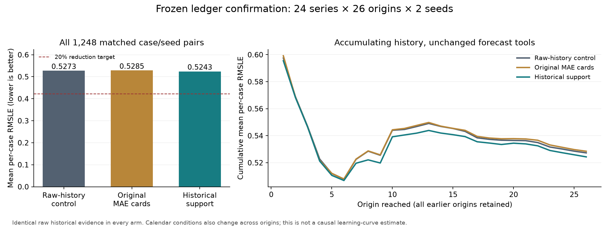

# Frozen ledger confirmation 010: target not established

The 20% target was **not met**. The ledger support treatment reduced mean
per-case RMSLE by **0.56%**, with a paired 95% interval of **−0.36% to +1.82%**.
This does not establish a reliable mean improvement over the equal-information
control. It also does not establish a general robustness advantage.

All implementation changes and evidence remain on `dev/ledger-optimization`.
No main merge, release tag or PyPI publication was made for this work.

## Complete registered comparison

| Arm | Decisions | Mean per-case RMSLE |
| --- | ---: | ---: |
| Raw-history control (`no_ledger`) | 1,248 | 0.5272968020 |
| Original MAE ledger cards (`ledger_119`) | 1,248 | 0.5284976078 |
| Historical support (`ledger_supported`) | 1,248 | 0.5243270335 |

24 reserved series × 26 consecutive origins × two requested seeds × three
arms = **3,744 decisions**, or 1,248 matched case/seed pairs. Every arm received
the same raw matured historical rows, current context, CV evidence, forecasting
candidates and tools. Only the organization/derived summary of past evidence
differed. Actual input tokens differed and are reported below.

The historical support rule was selected on development, then frozen before
confirmation preparation: use all matched history, require four origins, lower
mean RMSLE and paired wins on at least half the origins to support changing the
current-CV provider. The agent still selected and executed a fixed candidate.
Neither the ledger nor this rule changed or combined forecast values.

The treatment improved **0.79%** against the original ledger, with a 95% paired
interval of **−0.06% to +2.00%**. That interval also crosses zero. The much larger
3.48% development improvement did not carry over to this reserved cohort.

The registered analysis uses 5,000 paired bootstrap replicates, seed 20260911,
resampled series and shared circular four-origin blocks, retaining both agent
seeds together. All cold starts and outcomes remain in the primary denominator.
There was no optional stopping or tuning on partial confirmation scores.

## Why repeating selection tuning cannot deliver 20% here

The target would require mean RMSLE **0.4218374416** or lower. Independently
choosing the best of the eight fixed forecasts for every case *after observing
its actuals* gives **0.4614605508**, only **12.4856%** below the observed control.

Every permitted selection policy must choose one of those same forecasts, so
its case loss cannot be below that case's minimum candidate loss. Averaging
preserves this inequality. Thus **20% is mathematically unattainable on this
fixed cohort with this fixed candidate portfolio and observed control**.

This oracle is a bound, not a deployable policy. It does not establish a bound
on all unseen datasets. The completed confirmation set is now spent: selecting
new rules against it and calling a rerun untouched confirmation would be invalid.
Weakening the control, changing the score, selecting favorable cases or changing
forecast values would not fulfill the original objective. Further work needs a
new explicitly declared objective/test scope; no such change was made here.

## Robustness and execution

Treatment versus control: 146 better case/seed pairs, 105 worse and 997 tied
(absolute loss-difference tolerance 1e-12). Mature-history RMSLE was 0.5248916507
versus 0.5281279262; this subgroup does not replace the primary result.

Worst-decile mean RMSLE was 1.1560999377 versus 1.1579284862, a small descriptive
difference. Provider-name agreement between requested seeds was **509/624** for
the treatment versus **571/624** for control. Different provider names can yield
identical forecasts, and agreement is not accuracy. These results do not support
a blanket claim that the ledger made decisions more robust.

All 3,744 decisions ended with **explicit execution-bound selections**. There
were zero API errors, zero harness failures and zero final fallback forecasts.
That does not mean every intermediate call succeeded: five calls exceeded the
forecast budget, five intermediate selections lacked a successful matching
execution, and one forecast request had invalid arguments. All recovered within
the common limits; their raw traces are retained. The boundary audit reconciles
8,707 successful candidate-playback executions with tool messages.

The 4,992 prepared candidate forecast records and their CV records disclosed
zero recipe fallbacks. Forecasts were computed with the original pinned
StatsForecast recipes and then reused identically through task-validated Gnomon
playback. Playback calls are not additional fresh StatsForecast model fits.

## Audits and provenance

- Freeze committed as **1709b4c** before confirmation preparation; treatment
  implementation commit **2721c18**. All critical source/protocol hashes remained
  unchanged through the completed run.
- All 3,744 decisions passed the shared-information, system-message,
  request-fingerprint, budget, fixed-forecast and independent RMSLE audit.
- The additional read-only audit checked 624 cases, 4,992 executions, 7,800
  historical-origin exposures, 109,200 actual-visibility checks and 124,800 raw
  historical score checks. The ledger's SHA-256 was unchanged by the audit.
- Provider history ended at its origin; future target demand was not supplied
  to the forecasters. Future covariates used promotion/calendar inputs.
- This is retrospective Favorita replay. Recording outcomes at horizon close,
  source availability at valid dates, zero-filled missing dates, clipped returns
  and known promotion plans are disclosed assumptions, not genuine historical
  recording-vintage observations.
- Backend honoring of the two requested agent seeds remains unverified.

Some immutable outputs from the frozen analysis tools still contain inherited
"development" wording in their explanatory prose. Their machine-readable
`scope` is `confirmation`. The reviewed record corrects this presentation and
links the original unchanged artifacts; no numerical result was rewritten.

## Usage

| Arm | API calls | Input tokens | Output tokens |
| --- | ---: | ---: | ---: |
| Raw-history control | 2,579 | 12,296,321 | 715,052 |
| Original ledger | 2,544 | 15,047,230 | 819,765 |
| Historical support | 2,681 | 13,762,654 | 815,801 |
| Total | **7,804** | **41,106,205** | **2,350,618** |

No monetary cost was returned by the API; dollar cost is unknown, not zero.
These counts cover this complete confirmation run. Earlier development trials
and the incomplete accounting of failed pilot 001 remain separately documented.

## Evidence and reproduction

- [Reviewed result](evidence/confirmation-agent-010-reviewed.json)
- [Frozen comparison and confidence intervals](evidence/confirmation-agent-010-analysis.json)
- [Mathematical headroom bound](evidence/confirmation-agent-010-headroom.json)
- [Information/arithmetic audit](evidence/confirmation-agent-010-audit.json)
- [Visibility audit](evidence/confirmation-agent-010-visibility-audit.json)
- [Boundary audit](evidence/confirmation-agent-010-boundary-audit.json)
- [Freeze/provenance audit](evidence/confirmation-agent-010-provenance-audit.json)
- [Descriptive robustness](evidence/confirmation-agent-010-robustness.json)
- [Full per-case summary and raw trace hashes](evidence/confirmation-agent-010.json)
- [Freeze](evidence/confirmation-freeze-010.json)

Raw transcripts, fixed forecasts, prepared cases, historical packets and ledger
copies remain under `results/ledger-optimization/confirmation-agent-010` and
`results/ledger-optimization/confirmation-prepared-010`. They are excluded from
Git for size, with hashes/paths in the tracked evidence. Post-run audit scripts
are in `audits/`; the boundary/plot scripts use the recorded workspace layout.
Run the frozen preparation/agent pipeline from commit 1709b4c and the original
pinned manifests. Never mutate the archived ledgers or overwrite the run when
repeating an experiment. A rerun of these cases is replication, not a fresh
confirmation test.

