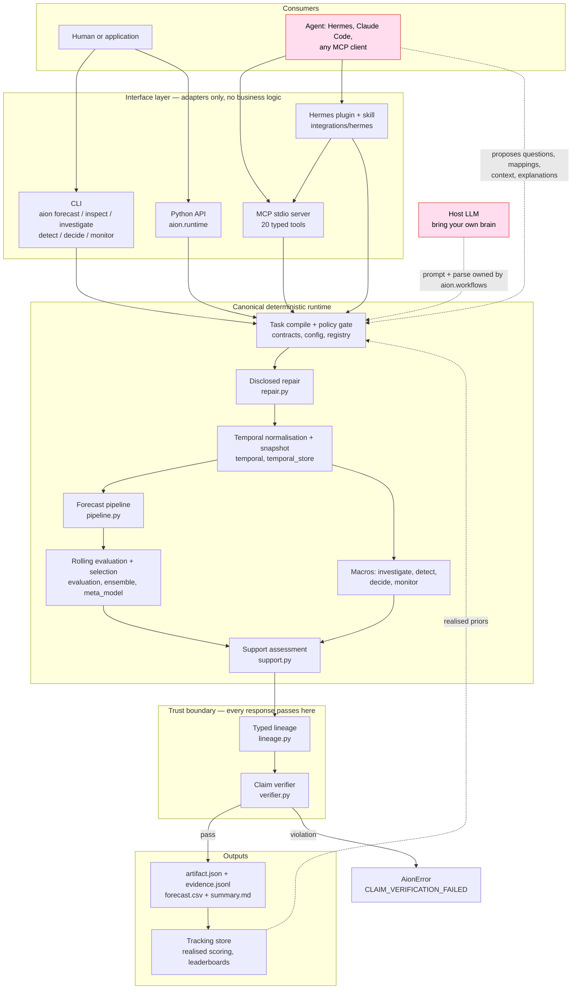
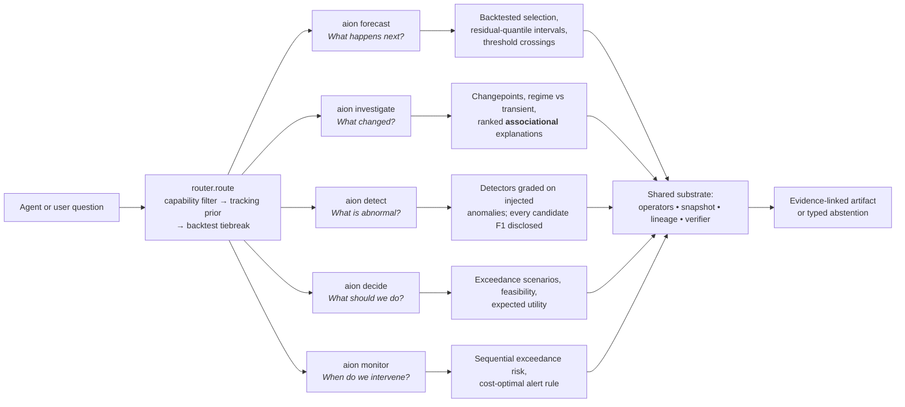
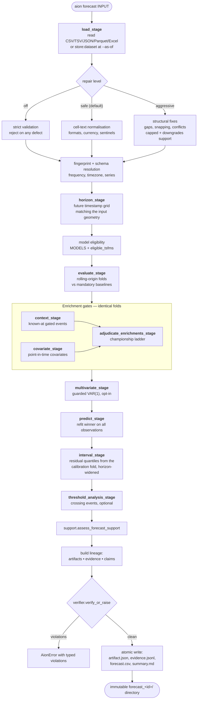
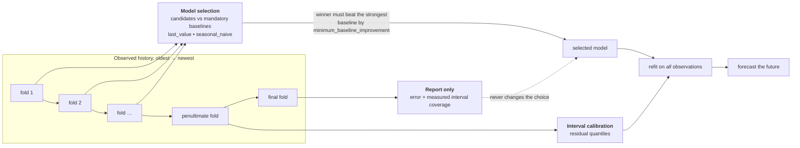
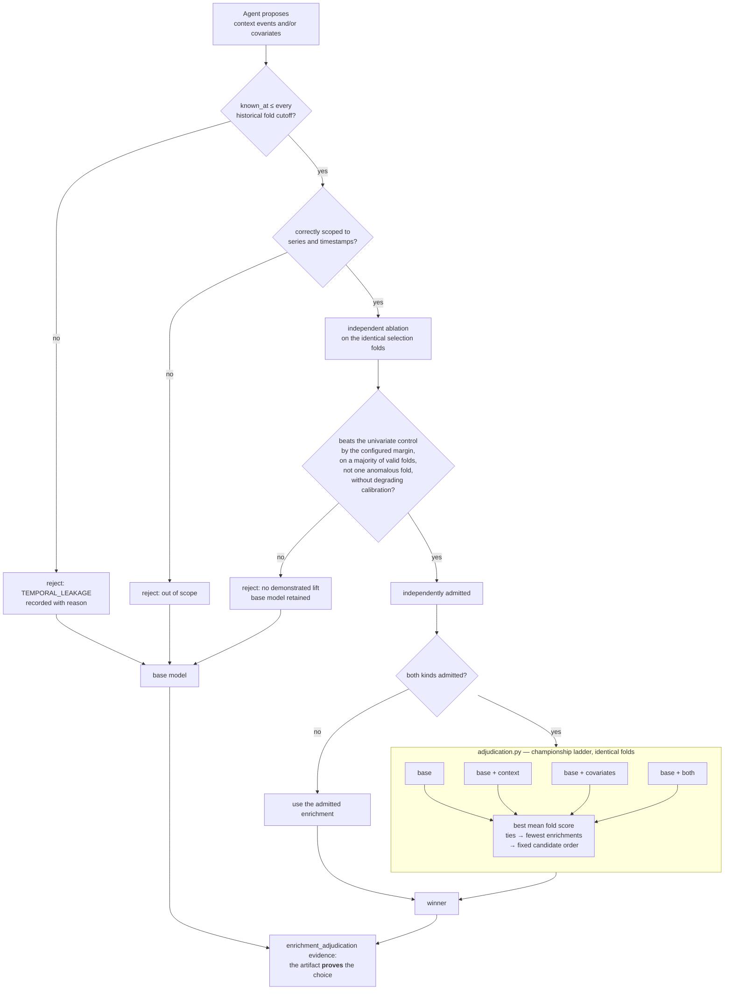
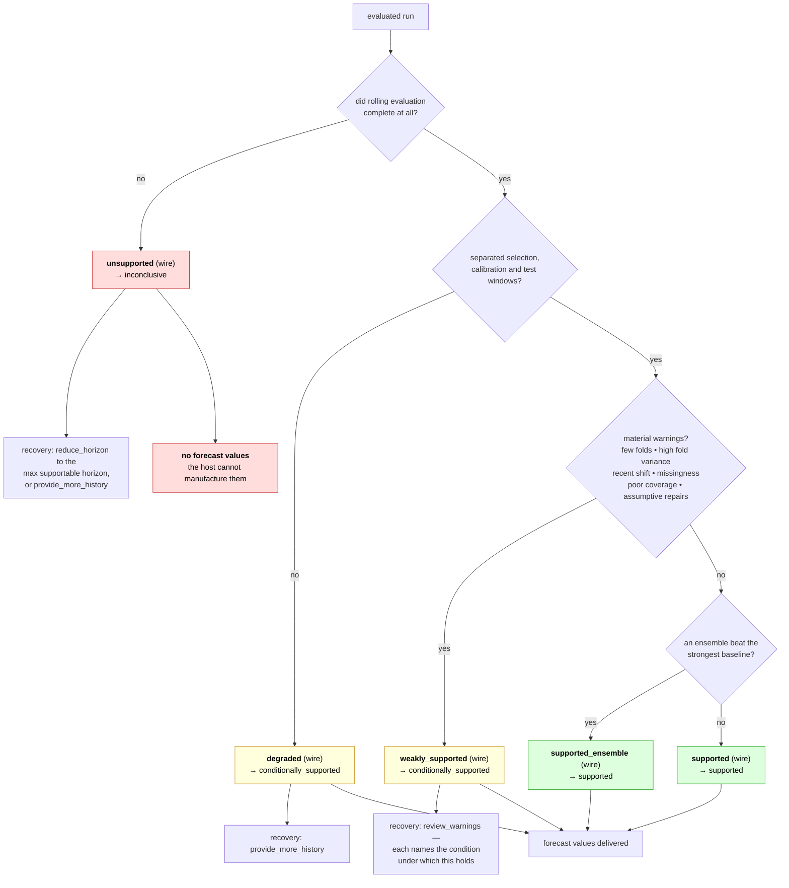
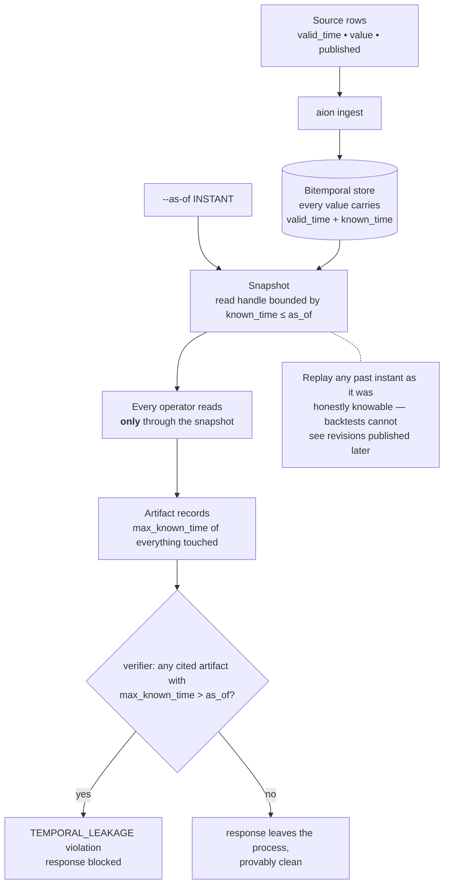
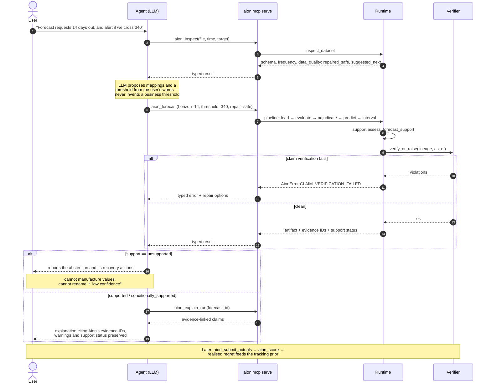
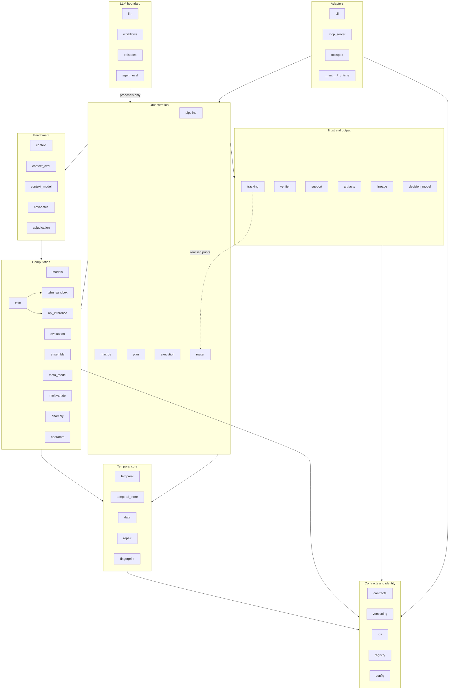
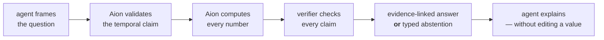

# Aion architecture

Mermaid maps of the design described in
[`Aion_System_Design.md`](../Aion_System_Design.md), drawn against what the
code in `src/aion` actually does. Every diagram renders on GitHub.

The single invariant all of these encode: **the LLM proposes; Aion validates,
computes, and owns every number.** Nothing on an agent's side of a boundary
in these diagrams can produce or edit a forecast value, a metric, an
interval, a selection decision, or a support status.

| Diagram | Question it answers |
| --- | --- |
| [1. Layers](#1-layers) | Who calls what, and where does business logic live? |
| [2. Five verbs](#2-five-verbs) | What can Aion be asked to do? |
| [3. Forecast pipeline](#3-forecast-pipeline) | How does a file become an artifact? |
| [4. Evaluation partitions](#4-evaluation-partitions) | Why is the reported score honest? |
| [5. Enrichment admission](#5-enrichment-admission) | How does outside knowledge earn its place? |
| [6. Support states](#6-support-states) | When does Aion refuse? |
| [7. Bitemporal store](#7-bitemporal-store) | How is leakage made structural? |
| [8. Agent sequence](#8-agent-sequence) | What does a real agent turn look like? |
| [9. Module map](#9-module-map) | Which module owns which responsibility? |

---

## 1. Layers

The runtime library is canonical. CLI, MCP, Python, and the Hermes plugin are
adapters over the same contracts — no business logic exists only in a command
handler or a prompt.

Pink nodes are LLM-side — nothing there can produce a number. Dashed edges are
**proposal** paths. Solid edges inside the runtime are the only paths that
produce numbers, and they all terminate at the verifier.

---

## 2. Five verbs

One router, five questions, one shared substrate. Routing is advisory — the
evaluated run's own backtest is the final selector, and an explicit `model=`
override beats the router entirely.

`investigate` stops at ranked associational explanations **by design** — the
verifier's `CAUSAL_CAPABLE_KINDS` set is deliberately empty, so a causal claim
cannot be emitted no matter what an LLM writes.

---

## 3. Forecast pipeline

The stages in `pipeline.py`, in execution order, as driven by
`runtime.forecast`.

---

## 4. Evaluation partitions

Design review decision 1: the partitions are **disjoint**. This is what makes
the reported number something other than the number the selection procedure
was optimised against.

If there is not enough history to separate all three windows, the run does not
silently collapse them — it reports `degraded` (see next diagram).

---

## 5. Enrichment admission

Outside knowledge — an LLM-proposed launch date, an externally fetched
covariate — never improves a forecast by assertion. Each enrichment passes its
own ablation gate; when both are supplied, the adjudication ladder picks a
winner on identical folds and records the whole comparison as evidence.

---

## 6. Support states

Abstention is an answer. The v0.2 wire enum has five values;
`support.assess_forecast_support` maps them onto the harness vocabulary with
typed reasons and recovery actions, so a refusal is never a dead end.

A `supported` result means the current deterministic checks passed. It is not
a guarantee that the future will resemble history.

---

## 7. Bitemporal store

Leakage is structural, not behavioural: every read goes through a `Snapshot`
that *cannot* serve data published after its cutoff.

---

## 8. Agent sequence

A realistic turn: the agent frames and explains, Aion computes and refuses.

---

## 9. Module map

`src/aion`, grouped by responsibility. Arrows show the dominant dependency
direction; the temporal core never depends on an adapter.

---

## The one-line version

